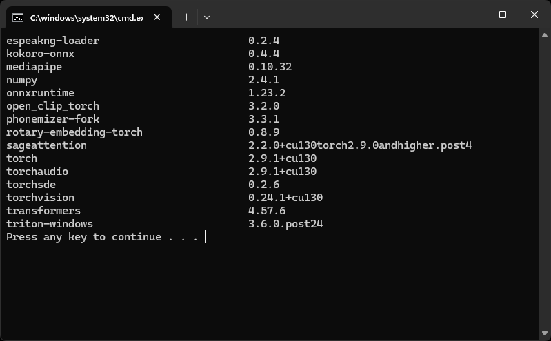

# ⚡ ComfyUI Advanced Installer

Get a pro-grade, portable ComfyUI environment in one click. Optimized for **Python 3.13**, **CUDA 13**, and **SageAttention** for maximum speed on Windows.

⚠️ **Official Version:** This is the original repository. If you are viewing this on any account other than `the3minutenode`, it is a fork and may not be up to date or verified.

## 🚀 Why use this?

* **Faster:** Pre-configured with Triton and SageAttention for 30/40-series GPUs.
* **Cleaner:** Portable "embedded" install. Everything stays inside one folder. It won't touch your system Python.
* **Modern:** Uses Python 3.13 and the newest CUDA 13.0 drivers.
* **Pre-Loaded:** Only includes the **barebone essentials** required for professional workflows: (Manager, IPAdapter, Impact Pack, etc.).

## 🛠️ Quick Start

1. **Install Git:** Download and install [Git for Windows](https://git-scm.com/) (required to download the nodes).
2. **Download the Script:** **[Download the Latest Release](https://github.com/the3minutenode/ComfyUI-Advanced-Installer/releases/latest)**. Put it in a folder where you want ComfyUI to live (e.g., `C:\AI\`).
3. **Run Installer:** Double-click `comfy-adv-install.bat`. *Note: It will download ~5GB of data. Grab a coffee.*
4. **Link Models (Optional):** Near the end of the installation, a message will ask if you want to link an existing model folder.
5. **Download IPAdapter Models (Optional but Recommended):** To use Face Lock or Style Transfer, run the `ipadapter-downloader.bat`. This will fetch the necessary heavy-weight models (~15GB).
6. **Launch:** When finished, a `run.bat` file will appear. Double-click **`run.bat`** to start creating.
7. **Update:** Use `update.bat` if you need to update the ComfyUI.

https://github.com/user-attachments/assets/6191c723-defe-4c70-a926-da3bc6c433a5

Demo on Youtube:

## 📦 What’s inside the box?

### The Tech Stack

* **Python 3.13.9 + CUDA 13.0**: The bleeding edge of AI performance.
* **SageAttention & Triton**: Faster rendering and better VRAM management.
* **Insightface**: High-accuracy face analysis and biometric recognition using state-of-the-art models.

### 🖼️ IPAdapter Model Downloader

The installer includes a dedicated script (`ipadapter-downloader.bat`) to automate the complex setup of IPAdapter Plus. It handles:

* **CLIP Vision Encoders:** Standard (ViT-H) and BigG models.
* **IPAdapter Weights:** Full suite for SD1.5 and SDXL (Plus, FaceID, Portrait, and Light versions).
* **FaceID LoRAs:** Essential for high-fidelity face cloning.
* **Auto-Sorting:** Automatically places files in `models/clip_vision`, `models/ipadapter`, and `models/loras`.
 
### Essential Nodes Included

You don't need to hunt these down; they are installed automatically:

* **ComfyUI-Manager**: The "App Store" for Comfy.
* **IPAdapter Plus**: For Face Lock and Style Transfer.
* **Impact Pack**: Essential for high-res detailing and inpainting.
* **GGUF Support**: Run massive models (like Flux) on lower VRAM.
* **SeedVR2**: Professional 4K upscaling.

## ⚠️ Requirements

* **OS:** Windows 10/11
* **GPU:** NVIDIA RTX 20-series or higher recommended (8GB+ VRAM preferred).
* **Storage:** ~15GB of free space.

## 🆘 Support & Updates

* **Having Issues?** If the script fails or you hit an error, please **[Open an Issue Here](https://github.com/the3minutenode/ComfyUI-Advanced-Installer/issues)** so the community can help.

**Join the Efficiency Movement:** [YouTube](https://www.youtube.com/@The3MinuteNode) | [Discord](https://discord.gg/wDn7cj68gm) | [Support the Project](https://www.paypal.com/donate/?hosted_button_id=EF3QDPEWK359N)
